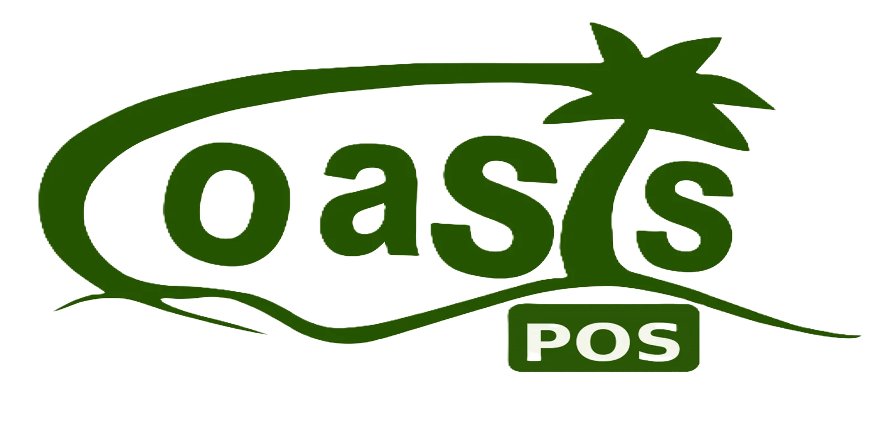

# Oasis POS

<div align="center">
  
</div>

<h3 align="center">The Ultimate Billing Solution for Modern Retail</h3>

<p align="center">
  A feature-rich, cross-platform Point of Sale (POS) application built with Flutter, designed for retail businesses of all sizes.
</p>

<p align="center">
  
  
  
</p>

---

## 📋 Table of Contents

- [About The Project](#-about-the-project)
- [✨ Key Features](#-key-features)
- [🛠️ Technology Stack](#-technology-stack)
- [📸 Screenshots](#-screenshots)
- [🚀 Getting Started](#-getting-started)
  - [Prerequisites](#prerequisites)
  - [Installation & Setup](#installation--setup)
- [📦 Build for Production](#-build-for-production)
- [🤝 Contributing](#-contributing)
- [📄 License](#-license)
- [📞 Contact](#-contact)

---

## 📖 About The Project

**Oasis POS** is a comprehensive Point of Sale system engineered with Flutter to deliver a seamless and intuitive user experience across multiple platforms. While its primary target is **Windows**, it is fully capable of running on Android, iOS, Linux, and macOS.

This application empowers retail businesses with a robust tool to manage sales, inventory, customers, and staff with ease. Its offline-first architecture ensures that your business keeps running, even when the internet connection doesn't.

---

## ✨ Key Features

- **🛒 Comprehensive Sales & Cart:** Intuitive interface for adding products, applying discounts (fixed or percentage), calculating taxes, and managing the cart.
- **📦 Offline-First Functionality:** Powered by a local SQLite database, the application remains fully functional without an internet connection. Transactions are synced when connectivity is restored.
- **💻 Cross-Platform Support:** Single codebase for Windows, Android, iOS, Linux, and macOS.
- **📠 Receipt Printing:** Generate and print professional receipts for customers.
- **🔳 Barcode Scanning:** Use the device camera or a dedicated scanner to quickly add products to the cart.
- **👥 Customer & Staff Management:** Manage customer information and assign service staff to transactions.
- **📊 Expense & Sales Tracking:** Keep track of business expenses and review sales history.
- **🌐 Centralized Backend Sync:** Seamlessly synchronizes data with a central server.
- **🎨 Customizable & Themeable:** Easily adaptable theme to match your brand's identity.
- **🌍 Localization Ready:** Built with internationalization support to cater to a global audience.

---

## 🛠️ Technology Stack

This project is built with a modern and robust stack:

- **Core Framework:** [Flutter](https://flutter.dev/)
- **Language:** [Dart](https://dart.dev/)
- **State Management:** [Provider](https://pub.dev/packages/provider)
- **Local Database:** [SQFlite](https://pub.dev/packages/sqflite) with FFI for desktop support.
- **Networking:** [HTTP](https://pub.dev/packages/http) & [Dio](https://pub.dev/packages/dio)
- **Device & Platform:** [Permission Handler](https://pub.dev/packages/permission_handler), [Printing](https://pub.dev/packages/printing), [Simple Barcode Scanner](https://pub.dev/packages/simple_barcode_scanner)
- **UI/UX:** [Google Fonts](https://pub.dev/packages/google_fonts), [FL Chart](https://pub.dev/packages/fl_chart), [Fluttertoast](https://pub.dev/packages/fluttertoast)
- **Utilities:** [Shared Preferences](https://pub.dev/packages/shared_preferences), [Intl](https://pub.dev/packages/intl)

---

## 📸 Screenshots

_(Add screenshots of your application here to showcase its beautiful UI.)_

| Login Screen                                 | Home Screen                            | Cart Screen                            |
| -------------------------------------------- | -------------------------------------- | -------------------------------------- |
|  |  |  |

---

## 🚀 Getting Started

Follow these instructions to get a copy of the project up and running on your local machine for development and testing purposes.

### Prerequisites

Ensure you have the Flutter SDK installed and configured on your machine.

- [Flutter Installation Guide](https://flutter.dev/docs/get-started/install)

### Installation & Setup

1.  **Clone the repository:**

    ```sh
    git clone https://github.com/your_username/Oasis-windows-POS-v1.git
    cd Oasis-windows-POS-v1
    ```

2.  **Install dependencies:**

    ```sh
    flutter pub get
    ```

3.  **Configure the backend:**
    The application connects to a backend server. Update the API endpoint in `lib/config.dart`:

    ```dart
    class Config {
      static String baseUrl = "https://your-backend-url.com/";
      // ... other configurations
    }
    ```

4.  **Run the application:**
    You can run the app on any supported platform. For example, to run on Windows:
    ```sh
    flutter run -d windows
    ```
    Or for Android:
    ```sh
    flutter run -d android
    ```

---

## 📦 Build for Production

To create a release build for your desired platform, use the following commands:

- **Windows:**

  ```sh
  flutter build windows
  ```

- **Android (App Bundle):**

  ```sh
  flutter build appbundle
  ```

- **iOS:**
  ```sh
  flutter build ios
  ```

---

## 🤝 Contributing

Contributions are what make the open-source community such an amazing place to learn, inspire, and create. Any contributions you make are **greatly appreciated**.

1.  Fork the Project
2.  Create your Feature Branch (`git checkout -b feature/AmazingFeature`)
3.  Commit your Changes (`git commit -m '''Add some AmazingFeature'''`)
4.  Push to the Branch (`git push origin feature/AmazingFeature`)
5.  Open a Pull Request

---

## 📄 License

Distributed under the MIT License. See `LICENSE` file for more information.

---

## 📞 Contact

Your Name - your.email@example.com

Project Link: [https://github.com/your_username/Oasis-windows-POS-v1](https://github.com/your_username/Oasis-windows-POS-v1)
